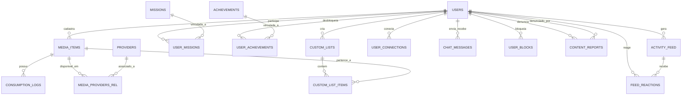

# Documentação Técnica e Especificação de Requisitos: Keeplay v2.0

Este documento formaliza a expansão de escopo da plataforma **Keeplay**, organizando as novas funcionalidades em requisitos funcionais claros, critérios de aceitação e a modelagem estrutural necessária para o banco de dados (Relacional SQL e NoSQL / Document Store).

---

## 1. Visão Geral do Sistema

O **Keeplay** é uma plataforma cultural e rede social de entretenimento que permite aos usuários registrar, avaliar, resenhar e acompanhar seu consumo de **Filmes, Séries, Livros e Jogos**. 

A versão 2.0 introduz 5 grandes pilares:
1. **Gamificação Avançada**: Missões mensais rotativas, conquistas secretas e títulos de perfil desbloqueáveis e equipáveis.
2. **Comunidade & Interação**: Listas temáticas personalizadas (públicas/privadas), feed social de atividades dos amigos e medidor de afinidade cultural (% de compatibilidade).
3. **Consumo Detalhado**: Status específicos por categoria de mídia, contadores de progresso (episódios, temporadas, páginas) e diário de consumo cronológico.
4. **Estatísticas & Retrospectiva**: Dashboard visual com distribuição de gêneros, estimativa de tempo investido e retrospectiva interativa periódica ("Wrapped").
5. **Integrações & Portabilidade**: Mapeamento de onde assistir/jogar (provedores e plataformas) e importação/exportação de dados via CSV e APIs públicas.

---

## 2. Requisitos Funcionais (RF)

### 2.1. Módulo de Gamificação

#### [RF-01] Missões Temporárias Mensais
- **Descrição**: O sistema deve disponibilizar um conjunto de missões com validade mensal que oferecem recompensas de XP e medalhas especiais.
- **Atores**: Usuário autenticado.
- **Entradas**: Ações rotineiras do usuário (cadastrar mídias, avaliar com estrelas, escrever resenhas).
- **Saídas**: Barra de progresso atualizada em tempo real, indicação de dias restantes no mês e botão de resgate da recompensa de XP.
- **Regras de Negócio**:
  - As missões são renovadas a cada primeiro dia do mês.
  - Cada missão possui uma meta quantitativa (ex: 3 filmes assistidos, 2 avaliações de jogos 4+ estrelas).
  - O usuário pode resgatar o bônus de XP após atingir 100% da meta.

#### [RF-02] Conquistas Secretas ("Easter Eggs")
- **Descrição**: O sistema deve possuir conquistas cujo título e critério de desbloqueio permanecem ocultos (exibindo "???") até que o usuário atenda aos requisitos ocultos.
- **Atores**: Usuário autenticado.
- **Entradas**: Ações com condições específicas (ex: registrar de madrugada entre 00:00 e 05:00, conceder nota 1 com texto longo, platinar um jogo, cadastrar 3 obras no mesmo dia).
- **Saídas**: Notificação festiva (toast e confetes), revelação do card com ícone e descrição no modal de conquistas.
- **Regras de Negócio**:
  - Antes do desbloqueio, o card deve exibir visual enigmático sem revelar o gatilho.
  - Ao ser desbloqueada, a conquista concede pontuação extra de XP e é adicionada permanentemente ao perfil.

#### [RF-03] Títulos de Perfil Desbloqueáveis e Equipáveis
- **Descrição**: O sistema deve permitir que o usuário selecione e exiba um título honorífico no seu perfil e nos cartões sociais com base no nível atingido e marcos alcançados.
- **Atores**: Usuário autenticado.
- **Entradas**: Seleção do título em dropdown/lista de títulos desbloqueados no painel de edição de perfil.
- **Saídas**: Exibição do título selecionado no cabeçalho, no perfil público e nos cartões de membros da comunidade.
- **Regras de Negócio**:
  - Títulos bloqueados devem exibir o requisito necessário (ex: "Alcançar Nível 4", "Desbloquear 5 Conquistas").
  - O usuário só pode equipar títulos que já foram desbloqueados.

---

### 2.2. Módulo de Comunidade

#### [RF-04] Criação e Gestão de Listas Personalizadas
- **Descrição**: O usuário deve poder criar coleções personalizadas de obras (ex: "Melhores Sci-Fi da Década", "Livros que Mudaram Minha Vida", "Jogos para Zerar nas Férias").
- **Atores**: Usuário autenticado.
- **Entradas**: Título da lista, descrição opcional, indicador de visibilidade (Pública ou Privada) e seleção de itens do catálogo.
- **Saídas**: Lista organizada em grid/cards com contagem de obras e opção de compartilhamento.
- **Regras de Negócio**:
  - Listas privadas são visíveis apenas para o próprio criador.
  - Listas públicas são visíveis na seção de comunidade e no catálogo público do usuário.

#### [RF-05] Feed de Atividades dos Amigos
- **Descrição**: O sistema deve manter uma linha do tempo cronológica com as ações recentes realizadas exclusivamente pelos amigos confirmados e pelo próprio usuário.
- **Atores**: Usuário autenticado e amigos com vínculo aceito.
- **Entradas**: Eventos automáticos de consumo (novo item registrado, alteração de status, conquista desbloqueada, missão concluída).
- **Saídas**: Feed com cards visuais contendo autor, capa da mídia, ação realizada, nota/resenha e horário relativo.
- **Regras de Negócio**:
  - As publicações, notas e atividades só devem ser exibidas no feed social se o status da relação entre os usuários for formalmente aceito (`accepted`).
  - Atividades de usuários com solicitação pendente (`pending`), recusada (`rejected`) ou sem vínculo não são exibidas.
  - Usuários com perfil privado não geram eventos no feed (a menos que explicitamente permitido).
  - Amigos podem reagir às publicações do feed com ícones interativos (❤️ Curtir, 👏 Palmas, 🔥 Incrível).

#### [RF-06] Medidor de Afinidade Cultural entre Perfis
- **Descrição**: O sistema deve calcular dinamicamente o índice de compatibilidade (% de Afinidade) entre o usuário autenticado e qualquer outro perfil da comunidade.
- **Atores**: Usuário autenticado.
- **Entradas**: Acervo de mídias, categorias consumidas e notas atribuídas pelos dois usuários comparados.
- **Saídas**: Porcentagem de afinidade (0% a 100%) e selo descritivo (ex: "92% Almas Gêmeas Culturais", "70% Grande Conexão", "45% Gostos Ecléticos").
- **Regras de Negócio**:
  - O cálculo pondera: (a) similaridade de distribuição por categoria (filmes, séries, livros, jogos), (b) obras em comum ou gêneros coincidentes e (c) proximidade das avaliações dadas.

---

### 2.3. Módulo de Consumo

#### [RF-07] Status Específicos por Tipo de Mídia
- **Descrição**: Cada categoria de mídia deve oferecer opções de status alinhadas ao seu ciclo de vida natural de consumo.
- **Atores**: Usuário autenticado.
- **Entradas**: Seleção do status no modal de criação/edição:
  - **Jogos**: *Jogando*, *Zerado*, *Platinado (100%)*, *Backlog*, *Dropado*.
  - **Séries**: *Assistindo*, *Finalizada*, *Em Espera*, *Dropada*.
  - **Livros**: *Lendo*, *Concluído*, *Quero Ler*, *Abandonado*.
  - **Filmes**: *Assistido*, *Quero Assistir*, *Revisto*.
- **Saídas**: Badges coloridos específicos exibidos no card da mídia (ex: Platinado com brilho dourado especial).

#### [RF-08] Contadores de Progresso de Consumo
- **Descrição**: O sistema deve permitir o acompanhamento quantitativo do progresso em obras de longa duração.
- **Atores**: Usuário autenticado.
- **Entradas**:
  - Séries: Episódio atual e total de episódios; Temporada atual.
  - Livros: Página atual e total de páginas (ou porcentagem lida).
- **Saídas**: Barra de progresso visual no card da obra e indicador numérico (ex: "Ep. 14/24 - 58%").

#### [RF-09] Diário Cronológico de Consumo (Logs de Datas)
- **Descrição**: O usuário deve poder registrar datas de consumo e histórico de revisitas (re-watch / re-play / re-leitura).
- **Atores**: Usuário autenticado.
- **Entradas**: Data de início, data de término, data de revisitação e anotação rápida da sessão.
- **Saídas**: Histórico de datas exibido nos detalhes da obra e utilizado para cálculo de retrospectivas.

---

### 2.4. Módulo de Estatísticas & Retrospectiva

#### [RF-10] Dashboard Analítico no Perfil
- **Descrição**: O perfil do usuário deve apresentar um painel analítico com gráficos e métricas consolidadas.
- **Atores**: Usuário autenticado e visitantes (se o perfil for público).
- **Saídas**:
  - Gráfico de distribuição por mídia e gêneros favoritos.
  - Estimativa de horas totais investidas (cálculo ponderado por mídia/episódios/páginas).
  - Histograma de distribuição de notas (1 a 5 estrelas).
  - Taxa de conclusão (obras finalizadas vs. em andamento vs. abandonadas).

#### [RF-11] Retrospectiva Periódica Interativa ("Wrapped")
- **Descrição**: Geração de uma retrospectiva visual em formato de stories/slides celebrando as realizações culturais do período.
- **Atores**: Usuário autenticado.
- **Saídas**: Modal interativo em tela cheia com slides contendo:
  - Slide 1: Volume total de obras e horas dedicadas.
  - Slide 2: Obra favorita com nota máxima e citação da melhor resenha.
  - Slide 3: Categoria dominante e mês de maior pico de atividade.
  - Slide 4: Arquétipo cultural gerado (ex: *"Cinéfilo Noturno"*, *"Explorador de Fantasias"*) e botão de exportar/compartilhar resumo.

---

### 2.5. Módulo de Integrações & Dados

#### [RF-12] Indicação de Provedores e Plataformas (Onde Assistir/Jogar)
- **Descrição**: O usuário deve poder indicar em quais plataformas ou serviços de streaming a obra está disponível ou foi consumida.
- **Atores**: Usuário autenticado.
- **Entradas**: Seleção de tags de provedores (Netflix, Prime Video, Disney+, HBO Max, Apple TV+, Steam, PlayStation, Xbox, Nintendo Switch, Kindle, Livro Físico, Cinema, etc.).
- **Saídas**: Ícones/selos dos provedores visíveis no card e nos detalhes da obra.

#### [RF-13] Importação de Dados via Arquivo CSV
- **Descrição**: O sistema deve permitir o upload de planilhas em formato CSV para importação em lote de registros de mídias.
- **Atores**: Usuário autenticado.
- **Entradas**: Arquivo `.csv` com cabeçalhos padronizados (`titulo, categoria, status, nota, comentario, data`).
- **Saídas**: Processamento em lote, validação de linhas, ganho proporcional de XP e feedback visual de sucesso com relatório de itens importados.

#### [RF-14] Exportação de Dados e Backup (CSV e JSON)
- **Descrição**: O usuário deve ter soberania sobre seus dados, podendo baixar seu acervo completo em formato CSV ou JSON estruturado para backup ou migração.
- **Atores**: Usuário autenticado.
- **Saídas**: Download de arquivo `keeplay_backup_[usuario]_[data].csv` ou `.json`.

#### [RF-15] Fluxo Assíncrono de Solicitação e Gestão de Amizades
- **Descrição**: O sistema deve gerenciar o ciclo completo de conexões entre membros através de pedidos formais de amizade com estados bem definidos (`pending`, `accepted`, `rejected`, cancelado).
- **Atores**: Usuário autenticado solicitante e usuário destinatário.
- **Entradas**:
  - Solicitação de conexão (`POST /api/friends/request`).
  - Resposta do destinatário: Aceitar (`POST /api/friends/accept`) ou Recusar (`POST /api/friends/reject`).
  - Cancelamento pelo solicitante (`DELETE /api/friends/cancel`).
  - Remoção de amizade confirmada (`DELETE /api/friends/remove`).
- **Saídas**: Atualização do estado do botão nos cards de membros ("Conectar", "Solicitação enviada", "Aceitar/Recusar", "Amigos"), notificação com contagem na aba de solicitações pendentes e inclusão/remoção na lista de amigos mútuos.
- **Regras de Negócio**:
  - Ao clicar em "Conectar", cria-se uma conexão com status `pending`.
  - O solicitante visualiza o botão "Solicitação enviada" e tem a opção de cancelar o pedido antes de uma resposta.
  - O destinatário recebe a notificação e pode Aceitar ou Recusar a solicitação.
  - Somente após o aceite formal (`accepted`), ambos os usuários tornam-se amigos mútuos, e suas atividades passam a compor o feed social.
  - Caso a solicitação seja recusada (`rejected`) ou cancelada, o vínculo é desfeito imediatamente e ambos retornam ao estado inicial ("Conectar").
  - Um usuário não pode enviar solicitação para si mesmo nem duplicar pedidos já pendentes ou aceitos.

#### [RF-16] Tagging e Alerta de Spoilers com Ocultação Gradual (Blur CSS)
- **Descrição**: Permitir que usuários sinalizem avaliações e comentários com conteúdo revelador de enredo (spoilers), ocultando o texto por padrão com efeito de desfoque visual (CSS blur) até que o leitor opte explicitamente por revelá-lo.
- **Atores**: Autor do conteúdo e leitores da comunidade / feed social.
- **Entradas**: Checkbox "⚠️ Este comentário contém spoilers da obra" no modal de cadastro/edição de item (`#itemIsSpoiler`).
- **Saídas**:
  - Exibição de container de spoiler com classe `.is-blurred` (`filter: blur(5px)` e seleção de texto desabilitada).
  - Badge visual de advertência (`⚠️ SPOILER`) acompanhada de dica interativa ("clique para revelar" / "clique para ocultar").
  - Animação suave de transição CSS para remoção/aplicação do desfoque ao clicar sobre o elemento.
- **Regras de Negócio**:
  - Comentários sinalizados como spoiler são salvos com a flag booleana `isSpoiler: true`.
  - No feed de atividades e no catálogo de outros usuários, o texto é renderizado com a máscara protetora ativada por padrão.
  - O leitor pode alternar entre visível e oculto livremente clicando no container.
  - A denúncia de comentário não sinalizado aplica temporariamente a máscara de spoiler na sessão local como medida profilática imediata.

#### [RF-17] Sistema de Denúncia de Conteúdo (Reports & Moderação Comunitária)
- **Descrição**: Disponibilizar um mecanismo intuitivo para que membros denunciem comentários impróprios, ofensivos, spams ou que contenham spoilers não demarcados.
- **Atores**: Membro denunciante e moderadores do sistema.
- **Entradas**:
  - Abertura de modal de denúncia (`#reportModal`) a partir do botão contextual "🚨 Denunciar" presente nos cards do feed e catálogos de terceiros.
  - Seleção de motivo obrigatório:
    - `spoiler_unmarked`: Spoiler não sinalizado;
    - `offensive`: Conteúdo ofensivo ou discurso de ódio;
    - `spam`: Spam ou propaganda não solicitada;
    - `other`: Outro motivo.
  - Campo de justificativa / detalhes adicionais (opcional).
- **Saídas**:
  - Registro estruturado na entidade `content_reports` (`POST /api/moderation/report`).
  - Feedback visual imediato via notificação toast confirmando o recebimento da denúncia.
  - Mitigação visual em tempo real: caso o motivo seja `spoiler_unmarked`, o comentário denunciado é imediatamente desfocado na interface do usuário ativo.

#### [RF-18] Bloqueio Bidirecional de Usuários (User Blocking & Privacidade)
- **Descrição**: Permitir o bloqueio direto de usuários tóxicos ou indesejados, cessando imediatamente interações sociais, solicitações de amizade e a visibilidade de perfis e atividades.
- **Atores**: Usuário que bloqueia e usuário bloqueado.
- **Entradas**: Ação de bloqueio no card de membro da comunidade ou no cabeçalho do perfil/catálogo (`POST /api/moderation/block` / `DELETE /api/moderation/unblock`).
- **Saídas**:
  - Registro de bloqueio persistido na base (`user_blocks`).
  - Rescisão instantânea de amizade mútua aceita e cancelamento de quaisquer solicitações pendentes entre ambos.
  - Ocultação de atividades do usuário bloqueado no feed social.
  - Bloqueio de visualização de catálogo/perfil: caso o usuário tente acessar o catálogo de quem o bloqueou (ou de quem ele bloqueou), uma tela de advertência e restrição é exibida, com botão de desbloqueio quando aplicável.
  - Aba de gerenciamento "Bloqueados" dentro da seção de Comunidade, exibindo a lista de membros bloqueados pelo usuário com botão direto para "Desbloquear".
  - Impossibilidade de o usuário bloqueado enviar novas solicitações de amizade.

#### [RF-19] Exclusão Definitiva de Conta e Dados Pessoais (LGPD / Privacy)
- **Descrição**: Permitir que o usuário solicite a exclusão irrevogável de sua conta e todos os seus dados armazenados nas configurações de seu perfil, em total conformidade com os direitos de privacidade e esquecimento previstos pela LGPD.
- **Atores**: Usuário autenticado titular da conta.
- **Entradas**:
  - Acionamento do botão "Excluir Perfil" na Zona de Perigo do painel de edição do perfil (`.profile-danger-zone`);
  - Confirmação em modal seguro (`#deleteAccountModal`) com validação dupla:
    - Digitação exata do `@username` correspondente à conta ativa;
    - Digitação da senha de acesso válida para autenticação de segurança.
- **Saídas**:
  - Expurgo relacional em cascata de todos os registros do usuário (`media_items`, `custom_lists`, `consumption_logs`, `user_achievements`, `user_mission_progress`);
  - Rescisão de conexões sociais e exclusão de solicitações pendentes (`user_connections`);
  - Expurgo de postagens, resenhas e reações registradas no feed social (`activity_feed`, `feed_reactions`);
  - Remoção de bloqueios (`user_blocks`) associados;
  - Encerramento imediato da sessão (`handleLogout()`), limpeza de tokens locais e redirecionamento para a tela de autenticação;
  - Feedback visual via toast notificando a exclusão definitiva.
- **Regras de Negócio**:
  - O sistema impede a exclusão caso o `@username` ou a senha não coincidam com os dados cadastrados;
  - A ação é estritamente irreversível e não mantém dados órfãos na base relacional ou no armazenamento local.

#### [RF-20] Módulo de Chats & Mensagens Diretas entre Amigos Confirmados
- **Descrição**: O sistema deve fornecer uma aba dedicada de Chats permitindo a troca de mensagens de texto e reações rápidas de entretenimento em tempo real exclusivamente entre usuários com amizade aceita (`accepted`), com controle integral de exclusão de históricos de conversa e de mensagens individuais.
- **Atores**: Usuários autenticados com vínculo de amizade mútuo confirmado.
- **Entradas**:
  - Envio de mensagem direta de texto ou reação rápida (`POST /api/chat/messages`).
  - Consulta do histórico de mensagens com determinado amigo (`GET /api/chat/messages?friendId={id}`).
  - Sinalização de leitura de mensagens pendentes (`PUT /api/chat/messages/read`).
  - Exclusão do histórico completo de conversa com um amigo (`DELETE /api/chat/conversations/:friendId`), acionado pelo botão "Excluir Chat" no cabeçalho ativo (`#btnActiveChatDeleteChat`) ou pelo ícone de lixeira no card do amigo na sidebar (`.btn-chat-item-delete`).
  - Exclusão de mensagem individual (`DELETE /api/chat/messages/:id`), acionado pelo botão contextual de exclusão (`.btn-msg-delete`) presente na bolha da mensagem.
  - Atalhos diretos de conversa a partir dos cartões de membros na Comunidade e do modal de perfil/catálogo do amigo.
- **Saídas**:
  - Aba de navegação "💬 Chats" no topo com badge dinâmico de mensagens não lidas.
  - Painel de duas colunas: Sidebar com busca e listagem de amigos conectados ordenada pelas conversas mais recentes, e Área da Conversa Ativa com histórico cronológico, separadores de data e indicador de "digitando...".
  - Barra de reações culturais rápidas (🍿 Pipoca, 🎬 Cinema, 🎮 Games, 📚 Livros, ⭐ Nota Máxima, etc.).
  - Diálogo nativo de confirmação de segurança antes da exclusão para prevenir perdas acidentais de dados.
  - Feedback visual imediato via notificação toast confirmando a exclusão de mensagens ou conversas inteiras.
- **Regras de Negócio**:
  - O envio de mensagens diretas é restrito estritamente a usuários que possuam vínculo de amizade formalmente aceito (`status === 'accepted'`).
  - Membros sem conexão, com pedidos pendentes ou com bloqueio ativo não podem enviar mensagens diretas.
  - Caso uma amizade seja desfeita ou um usuário seja bloqueado, a interface do chat é imediatamente bloqueada para novos envios.
  - Ao excluir um chat com um amigo, todas as mensagens trocadas bidirecionalmente entre ambos são expurgadas do armazenamento, o contador de não-lidas é recalculado e a interface é atualizada em tempo real.
  - As mensagens são persistidas localmente no armazenamento `keeplay_messages` e sincronizadas entre as sessões.

#### [RF-21] Consentimento Formal e Termos de Uso com Conformidade LGPD
- **Descrição**: O formulário de cadastro de nova conta deve conter checkbox obrigatório de consentimento acompanhado de link contextual para leitura dos Termos de Uso e Política de Tratamento de Dados (Lei Geral de Proteção de Dados - LGPD nº 13.709/2018).
- **Atores**: Usuário não autenticado em processo de criação de conta.
- **Entradas**:
  - Clique no link "Termos de Uso e Proteção de Dados (LGPD)" (`#btnOpenTermsModal`);
  - Marcação da caixa de consentimento (`#regAcceptTerms`);
  - Confirmação direta através do botão "Concordo e Aceito os Termos" no rodapé do modal (`#btnAcceptTermsFromModal`).
- **Saídas**:
  - Abertura de modal responsivo (`#termsModal`) com texto claro e desprovido de juridiquês excessivo detalhando:
    1. Escopo e finalidade da plataforma cultural;
    2. Dados estritamente necessários coletados (nome, @username, senha, acervo e mensagens);
    3. Garantia expressa de ausência de coleta de dados sensíveis (sem CPF, sem dados financeiros, sem geolocalização contínua);
    4. Direitos do titular garantidos pelo Artigo 18 da LGPD (acesso, correção, portabilidade em CSV/JSON e direito ao esquecimento/exclusão total);
    5. Política de não comercialização de dados com terceiros;
  - Bloqueio de submissão do formulário caso o checkbox não esteja marcado, com feedback de validação claro;
  - Gravação do timestamp de consentimento (`acceptedTermsAt` / `accepted_terms_at`) no registro relacional do usuário.

---

## 3. Requisitos Não-Funcionais (RNF)

- **[RNF-01] Desempenho**: A renderização de listas e catálogos com até 500 itens deve ocorrer em menos de 100ms no navegador.
- **[RNF-02] Responsividade**: O layout deve se adaptar fluidamente a smartphones (360px+), tablets (768px+) e desktops (1024px+ a 4K).
- **[RNF-03] Tolerância a Falhas e Migração**: Caso o formato dos dados em `localStorage` seja de versão anterior, o sistema deve executar migração transparente sem perda de dados do usuário.
- **[RNF-04] Acessibilidade**: Componentes interativos devem possuir atributos ARIA, suporte a navegação por teclado e contraste de cor adequado (WCAG AA).
- **[RNF-05] Privacidade**: Os dados de perfis privados e listas privadas nunca devem ser expostos na API/UI para outros usuários não autorizados.

---

## 4. Especificação de Rotas e Endpoints da API REST

### 4.1. Amizades & Conexões

| Método | Rota | Descrição | Corpo da Requisição (Payload) | Resposta de Sucesso |
| :--- | :--- | :--- | :--- | :--- |
| `POST` | `/api/friends/request` | Envia solicitação de amizade pendente para outro membro. | `{ "targetUserId": "usr_lucas" }` | `201 Created` `{ "id": "conn_123", "status": "pending", "createdAt": "..." }` |
| `POST` | `/api/friends/accept` | Destinatário aceita o pedido pendente. | `{ "connectionId": "conn_123" }` | `200 OK` `{ "status": "accepted", "updatedAt": "..." }` |
| `POST` | `/api/friends/reject` | Destinatário recusa o pedido pendente. | `{ "connectionId": "conn_123" }` | `200 OK` `{ "status": "rejected", "message": "Vínculo desfeito com sucesso" }` |
| `DELETE`| `/api/friends/cancel` | Solicitante cancela pedido pendente antes da resposta. | `{ "targetUserId": "usr_lucas" }` | `200 OK` `{ "message": "Solicitação cancelada" }` |
| `DELETE`| `/api/friends/remove` | Desfaz vínculo de amizade aceito anteriormente. | `{ "friendUserId": "usr_maria" }` | `200 OK` `{ "message": "Amizade desfeita com sucesso" }` |
| `GET` | `/api/friends/pending` | Lista todas as solicitações pendentes (recebidas e enviadas). | *Nenhum* | `200 OK` `{ "incoming": [...], "outgoing": [...] }` |
| `GET` | `/api/friends/list` | Retorna a lista de amigos confirmados (`accepted`). | *Query param: ?userId=usr_xxx* | `200 OK` `[{ "id": "usr_xxx", "name": "...", "avatar": "..." }]` |

### 4.2. Moderação, Denúncias e Bloqueios

| Método | Rota | Descrição | Corpo da Requisição (Payload) | Resposta de Sucesso |
| :--- | :--- | :--- | :--- | :--- |
| `POST` | `/api/moderation/report` | Envia denúncia contra comentário ou spoiler não demarcado. | `{ "targetType": "comment", "targetId": "...", "authorId": "...", "reason": "spoiler_unmarked", "details": "..." }` | `201 Created` `{ "reportId": "rep_123", "status": "received" }` |
| `POST` | `/api/moderation/block` | Bloqueia um usuário, rescindindo vínculos e ocultando perfis. | `{ "targetUserId": "usr_carlos", "reason": "incomodo" }` | `200 OK` `{ "blocked": true, "targetUserId": "usr_carlos" }` |
| `DELETE`| `/api/moderation/unblock`| Remove o bloqueio de um usuário previamente bloqueado. | `{ "targetUserId": "usr_carlos" }` | `200 OK` `{ "unblocked": true }` |
| `GET` | `/api/moderation/blocked`| Retorna a lista de membros bloqueados pelo usuário logado. | *Nenhum* | `200 OK` `[{ "userId": "usr_carlos", "name": "...", "blockedAt": "..." }]` |

### 4.3. Gerenciamento de Conta & Privacidade (LGPD)

| Método | Rota | Descrição | Corpo da Requisição (Payload) | Resposta de Sucesso |
| :--- | :--- | :--- | :--- | :--- |
| `DELETE`| `/api/users/me` | Exclusão definitiva da conta ativa e expurgo relacional de todos os dados. | `{ "confirmUsername": "rafael", "password": "..." }` | `200 OK` `{ "deleted": true, "message": "Conta e dados excluídos definitivamente com sucesso" }` |

### 4.4. Chats & Mensagens Diretas (DMs entre Amigos Confirmados)

| Método | Rota | Descrição | Corpo da Requisição (Payload) | Resposta de Sucesso |
| :--- | :--- | :--- | :--- | :--- |
| `POST` | `/api/chat/messages` | Envia mensagem direta de texto ou reação rápida para amigo aceito. | `{ "receiverId": "usr_mariacine", "text": "Oi Maria!..." }` | `201 Created` `{ "id": "msg_xxx", "senderId": "...", "receiverId": "...", "createdAt": "..." }` |
| `GET` | `/api/chat/messages` | Consulta histórico cronológico de mensagens com determinado amigo. | *Query param: ?friendId=usr_mariacine* | `200 OK` `[{ "id": "...", "text": "...", "senderId": "...", "read": true, "timestamp": 123456 }]` |
| `PUT` | `/api/chat/messages/read` | Marca todas as mensagens pendentes recebidas do amigo como lidas. | `{ "friendId": "usr_mariacine" }` | `200 OK` `{ "success": true, "readCount": 2 }` |

---

## 5. Alterações e Modelagem do Banco de Dados

### 5.1. Diagrama Entidade-Relacionamento Conceitual



---

### 5.2. Modelo Relacional SQL (DDL PostgreSQL / MySQL 8+)

Abaixo está o script DDL completo para implantação em bancos de dados relacionais de produção (veja também os scripts prontos [schema.sql](file:///c:/Users/Rafael/Documents/Projeto/schema.sql) e [schema_mysql.sql](file:///c:/Users/Rafael/Documents/Projeto/schema_mysql.sql)):

```sql
-- =========================================================================
-- BANCO DE DADOS: Keeplay v2.0
-- Dialeto: PostgreSQL (Compatível com Supabase / RDS / Neon)
-- =========================================================================

-- Tipos Enumerados
CREATE TYPE media_category_enum AS ENUM ('filme', 'serie', 'livro', 'jogo');
CREATE TYPE media_status_enum AS ENUM (
    'assistido', 'quero_assistir', 'revisto',
    'assistindo', 'finalizada', 'em_espera', 'dropada',
    'lendo', 'lido', 'quero_ler', 'abandonado',
    'jogando', 'zerado', 'platinado', 'backlog', 'dropado'
);
CREATE TYPE list_visibility_enum AS ENUM ('publica', 'privada');
CREATE TYPE feed_reaction_enum AS ENUM ('like', 'applause', 'fire');
CREATE TYPE connection_status_enum AS ENUM ('pending', 'accepted', 'rejected');
CREATE TYPE report_reason_enum AS ENUM ('spoiler_unmarked', 'offensive', 'spam', 'other');
CREATE TYPE report_status_enum AS ENUM ('pending', 'reviewed', 'dismissed', 'action_taken');

-- 1. Tabela de Usuários (Expandida)
CREATE TABLE users (
    id VARCHAR(64) PRIMARY KEY,
    name VARCHAR(100) NOT NULL,
    username VARCHAR(50) UNIQUE NOT NULL,
    email VARCHAR(150) UNIQUE NOT NULL,
    password_hash VARCHAR(255) NOT NULL,
    avatar_url TEXT DEFAULT '',
    bio TEXT DEFAULT '',
    is_private BOOLEAN DEFAULT FALSE,
    equipped_title VARCHAR(100) DEFAULT 'Iniciante Curioso',
    total_xp INT DEFAULT 0,
    created_at TIMESTAMP WITH TIME ZONE DEFAULT CURRENT_TIMESTAMP,
    updated_at TIMESTAMP WITH TIME ZONE DEFAULT CURRENT_TIMESTAMP
);

-- Títulos Desbloqueados
CREATE TABLE user_unlocked_titles (
    user_id VARCHAR(64) NOT NULL REFERENCES users(id) ON DELETE CASCADE,
    title_name VARCHAR(100) NOT NULL,
    unlocked_at TIMESTAMP WITH TIME ZONE DEFAULT CURRENT_TIMESTAMP,
    PRIMARY KEY (user_id, title_name)
);

-- 2. Tabela de Conexões e Amizades (Ciclo de Vida Assíncrono com Status)
CREATE TABLE user_connections (
    id VARCHAR(64) PRIMARY KEY,
    requester_id VARCHAR(64) NOT NULL REFERENCES users(id) ON DELETE CASCADE,
    addressee_id VARCHAR(64) NOT NULL REFERENCES users(id) ON DELETE CASCADE,
    status connection_status_enum NOT NULL DEFAULT 'pending',
    created_at TIMESTAMP WITH TIME ZONE DEFAULT CURRENT_TIMESTAMP,
    updated_at TIMESTAMP WITH TIME ZONE DEFAULT CURRENT_TIMESTAMP,
    CONSTRAINT uq_connection_pair UNIQUE (requester_id, addressee_id),
    CONSTRAINT chk_different_users CHECK (requester_id <> addressee_id)
);

CREATE INDEX idx_connections_requester ON user_connections(requester_id, status);
CREATE INDEX idx_connections_addressee ON user_connections(addressee_id, status);

-- 3. Tabela de Chats e Mensagens Diretas (DMs entre Amigos)
CREATE TABLE chat_messages (
    id VARCHAR(64) PRIMARY KEY,
    sender_id VARCHAR(64) NOT NULL REFERENCES users(id) ON DELETE CASCADE,
    receiver_id VARCHAR(64) NOT NULL REFERENCES users(id) ON DELETE CASCADE,
    message_text TEXT NOT NULL,
    is_read BOOLEAN DEFAULT FALSE,
    created_at TIMESTAMP WITH TIME ZONE DEFAULT CURRENT_TIMESTAMP,
    updated_at TIMESTAMP WITH TIME ZONE DEFAULT CURRENT_TIMESTAMP,
    CONSTRAINT chk_chat_different_users CHECK (sender_id <> receiver_id)
);

CREATE INDEX idx_chat_conversation ON chat_messages(sender_id, receiver_id, created_at DESC);
CREATE INDEX idx_chat_unread ON chat_messages(receiver_id, is_read);

-- 4. Tabela de Obras do Catálogo (Expandida)
CREATE TABLE media_items (
    id VARCHAR(64) PRIMARY KEY,
    user_id VARCHAR(64) REFERENCES users(id) ON DELETE CASCADE,
    title VARCHAR(200) NOT NULL,
    category media_category_enum NOT NULL,
    status media_status_enum NOT NULL DEFAULT 'assistido',
    rating INT CHECK (rating BETWEEN 1 AND 5),
    comment TEXT,
    is_spoiler BOOLEAN DEFAULT FALSE,
    cover_image TEXT,
    xp_gained INT DEFAULT 50,
    
    -- Contadores de Consumo
    current_progress INT DEFAULT 0,       -- Ex: ep 12 ou pág 230
    total_progress INT DEFAULT 0,         -- Ex: 24 eps ou 450 págs
    season_current INT DEFAULT 1,         -- Temporada atual
    hours_spent NUMERIC(6, 1) DEFAULT 0,  -- Horas investidas
    
    created_at TIMESTAMP WITH TIME ZONE DEFAULT CURRENT_TIMESTAMP,
    updated_at TIMESTAMP WITH TIME ZONE DEFAULT CURRENT_TIMESTAMP
);

-- Índices de Performance no Catálogo
CREATE INDEX idx_media_user_category ON media_items(user_id, category);
CREATE INDEX idx_media_user_status ON media_items(user_id, status);

-- 4. Tabela de Provedores / Plataformas de Acesso
CREATE TABLE providers (
    id VARCHAR(50) PRIMARY KEY,
    name VARCHAR(100) NOT NULL,
    category VARCHAR(50) NOT NULL, -- 'streaming', 'store', 'hardware', 'leitura'
    icon_name VARCHAR(50) NOT NULL
);

-- Relacionamento N:N entre Itens e Provedores
CREATE TABLE media_item_providers (
    media_item_id VARCHAR(64) REFERENCES media_items(id) ON DELETE CASCADE,
    provider_id VARCHAR(50) REFERENCES providers(id) ON DELETE CASCADE,
    PRIMARY KEY (media_item_id, provider_id)
);

-- 5. Diário de Consumo (Logs de Datas e Revisitas)
CREATE TABLE consumption_logs (
    id VARCHAR(64) PRIMARY KEY,
    media_item_id VARCHAR(64) REFERENCES media_items(id) ON DELETE CASCADE,
    user_id VARCHAR(64) REFERENCES users(id) ON DELETE CASCADE,
    started_at DATE,
    finished_at DATE,
    notes TEXT,
    is_rewatch BOOLEAN DEFAULT FALSE,
    created_at TIMESTAMP WITH TIME ZONE DEFAULT CURRENT_TIMESTAMP
);

CREATE INDEX idx_consumption_dates ON consumption_logs(user_id, finished_at);

-- 6. Listas Personalizadas
CREATE TABLE custom_lists (
    id VARCHAR(64) PRIMARY KEY,
    user_id VARCHAR(64) REFERENCES users(id) ON DELETE CASCADE,
    title VARCHAR(150) NOT NULL,
    description TEXT,
    visibility list_visibility_enum DEFAULT 'publica',
    created_at TIMESTAMP WITH TIME ZONE DEFAULT CURRENT_TIMESTAMP,
    updated_at TIMESTAMP WITH TIME ZONE DEFAULT CURRENT_TIMESTAMP
);

-- Itens pertencentes às Listas
CREATE TABLE custom_list_items (
    list_id VARCHAR(64) REFERENCES custom_lists(id) ON DELETE CASCADE,
    media_item_id VARCHAR(64) REFERENCES media_items(id) ON DELETE CASCADE,
    added_at TIMESTAMP WITH TIME ZONE DEFAULT CURRENT_TIMESTAMP,
    display_order INT DEFAULT 0,
    PRIMARY KEY (list_id, media_item_id)
);

-- 7. Conquistas e Títulos (Mestres)
CREATE TABLE achievements (
    id VARCHAR(64) PRIMARY KEY,
    name VARCHAR(100) NOT NULL,
    category VARCHAR(50) NOT NULL, -- 'filme', 'serie', 'livro', 'jogo', 'especial', 'secreta'
    description TEXT NOT NULL,
    icon VARCHAR(20) NOT NULL,
    is_secret BOOLEAN DEFAULT FALSE,
    target_count INT DEFAULT 1,
    reward_xp INT DEFAULT 100,
    granted_title VARCHAR(100)
);

-- Conquistas Desbloqueadas por Usuário
CREATE TABLE user_achievements (
    user_id VARCHAR(64) REFERENCES users(id) ON DELETE CASCADE,
    achievement_id VARCHAR(64) REFERENCES achievements(id) ON DELETE CASCADE,
    unlocked_at TIMESTAMP WITH TIME ZONE DEFAULT CURRENT_TIMESTAMP,
    PRIMARY KEY (user_id, achievement_id)
);

-- 8. Missões Mensais Temporárias
CREATE TABLE monthly_missions (
    id VARCHAR(64) PRIMARY KEY,
    month_year VARCHAR(7) NOT NULL, -- Formato 'YYYY-MM'
    title VARCHAR(150) NOT NULL,
    description TEXT NOT NULL,
    category media_category_enum,
    target_count INT NOT NULL,
    reward_xp INT NOT NULL DEFAULT 150,
    icon VARCHAR(20) NOT NULL,
    expires_at TIMESTAMP WITH TIME ZONE NOT NULL
);

-- Progresso do Usuário nas Missões
CREATE TABLE user_mission_progress (
    user_id VARCHAR(64) REFERENCES users(id) ON DELETE CASCADE,
    mission_id VARCHAR(64) REFERENCES monthly_missions(id) ON DELETE CASCADE,
    current_count INT DEFAULT 0,
    is_completed BOOLEAN DEFAULT FALSE,
    is_claimed BOOLEAN DEFAULT FALSE,
    completed_at TIMESTAMP WITH TIME ZONE,
    PRIMARY KEY (user_id, mission_id)
);

-- 9. Feed Social de Atividades
CREATE TABLE activity_feed (
    id VARCHAR(64) PRIMARY KEY,
    user_id VARCHAR(64) REFERENCES users(id) ON DELETE CASCADE,
    activity_type VARCHAR(50) NOT NULL, -- 'item_added', 'item_status', 'achievement', 'mission'
    media_item_id VARCHAR(64) REFERENCES media_items(id) ON DELETE SET NULL,
    is_spoiler BOOLEAN DEFAULT FALSE,
    metadata JSONB, -- Dados adicionais (ex: nome da conquista, estrelas dadas)
    created_at TIMESTAMP WITH TIME ZONE DEFAULT CURRENT_TIMESTAMP
);

CREATE INDEX idx_feed_timeline ON activity_feed(created_at DESC);

-- Reações no Feed (Curtidas, Palmas, Fogo)
CREATE TABLE feed_reactions (
    activity_id VARCHAR(64) REFERENCES activity_feed(id) ON DELETE CASCADE,
    user_id VARCHAR(64) REFERENCES users(id) ON DELETE CASCADE,
    reaction feed_reaction_enum NOT NULL,
    created_at TIMESTAMP WITH TIME ZONE DEFAULT CURRENT_TIMESTAMP,
    PRIMARY KEY (activity_id, user_id, reaction)
);

-- 10. Tabela de Bloqueios de Usuários (Segurança e Privacidade)
CREATE TABLE user_blocks (
    id VARCHAR(64) PRIMARY KEY,
    blocker_id VARCHAR(64) NOT NULL REFERENCES users(id) ON DELETE CASCADE,
    blocked_id VARCHAR(64) NOT NULL REFERENCES users(id) ON DELETE CASCADE,
    reason TEXT,
    created_at TIMESTAMP WITH TIME ZONE DEFAULT CURRENT_TIMESTAMP,
    CONSTRAINT uq_block_pair UNIQUE (blocker_id, blocked_id),
    CONSTRAINT chk_different_block_users CHECK (blocker_id <> blocked_id)
);

CREATE INDEX idx_blocks_blocker ON user_blocks(blocker_id);
CREATE INDEX idx_blocks_blocked ON user_blocks(blocked_id);

-- 11. Tabela de Denúncias de Conteúdo (Reports de Spoilers e Ofensas)
CREATE TABLE content_reports (
    id VARCHAR(64) PRIMARY KEY,
    reporter_id VARCHAR(64) NOT NULL REFERENCES users(id) ON DELETE CASCADE,
    target_type VARCHAR(30) NOT NULL, -- 'media_item', 'activity_feed', 'comment'
    target_id VARCHAR(64) NOT NULL,
    author_id VARCHAR(64) REFERENCES users(id) ON DELETE SET NULL,
    reason report_reason_enum NOT NULL,
    details TEXT,
    content_snippet TEXT,
    status report_status_enum NOT NULL DEFAULT 'pending',
    created_at TIMESTAMP WITH TIME ZONE DEFAULT CURRENT_TIMESTAMP,
    updated_at TIMESTAMP WITH TIME ZONE DEFAULT CURRENT_TIMESTAMP
);

CREATE INDEX idx_reports_status ON content_reports(status);
CREATE INDEX idx_reports_target ON content_reports(target_type, target_id);
```

---

### 5.3. Modelo NoSQL / Document Store (JSON Schema)

Para implementações orientadas a documentos (MongoDB, Cloud Firestore ou estado persistente em `localStorage`), a estrutura do documento de usuário e coleções agregadas é definida conforme o esquema a seguir:

```json
{
  "$schema": "http://json-schema.org/draft-07/schema#",
  "title": "UsuarioKeeplay",
  "type": "object",
  "required": ["id", "name", "username", "password"],
  "properties": {
    "id": { "type": "string" },
    "name": { "type": "string" },
    "username": { "type": "string" },
    "password": { "type": "string" },
    "avatar": { "type": "string" },
    "bio": { "type": "string" },
    "isPrivate": { "type": "boolean" },
    "equippedTitle": { "type": "string" },
    "unlockedTitles": {
      "type": "array",
      "items": { "type": "string" }
    },
    "friends": {
      "type": "array",
      "items": { "type": "string" }
    },
    "blockedUsers": {
      "type": "array",
      "items": { "type": "string" }
    },
    "unlockedAchievements": {
      "type": "array",
      "items": { "type": "string" }
    },
    "monthlyMissions": {
      "type": "array",
      "items": {
        "type": "object",
        "properties": {
          "missionId": { "type": "string" },
          "progress": { "type": "integer" },
          "completed": { "type": "boolean" },
          "claimed": { "type": "boolean" }
        }
      }
    },
    "customLists": {
      "type": "array",
      "items": {
        "type": "object",
        "properties": {
          "id": { "type": "string" },
          "title": { "type": "string" },
          "description": { "type": "string" },
          "isPrivate": { "type": "boolean" },
          "itemIds": {
            "type": "array",
            "items": { "type": "string" }
          },
          "createdAt": { "type": "string" }
        }
      }
    },
    "items": {
      "type": "array",
      "items": {
        "type": "object",
        "required": ["id", "title", "category", "rating"],
        "properties": {
          "id": { "type": "string" },
          "title": { "type": "string" },
          "category": { "enum": ["filme", "serie", "livro", "jogo"] },
          "status": { "type": "string" },
          "rating": { "type": "integer", "minimum": 1, "maximum": 5 },
          "comment": { "type": "string" },
          "isSpoiler": { "type": "boolean" },
          "coverImage": { "type": "string" },
          "xpGained": { "type": "integer" },
          "providers": {
            "type": "array",
            "items": { "type": "string" }
          },
          "progress": {
            "type": "object",
            "properties": {
              "current": { "type": "integer" },
              "total": { "type": "integer" },
              "season": { "type": "integer" },
              "hours": { "type": "number" }
            }
          },
          "consumptionLogs": {
            "type": "array",
            "items": {
              "type": "object",
              "properties": {
                "id": { "type": "string" },
                "startedAt": { "type": "string" },
                "finishedAt": { "type": "string" },
                "notes": { "type": "string" },
                "isRewatch": { "type": "boolean" }
              }
            }
          },
          "createdAt": { "type": "string" }
        }
      }
    }
  }
}
```

---

### 5.4. Guia de Migração de Dados

Para garantir compatibilidade com bases legadas (v1.0), a rotina de migração no carregamento do estado executa as seguintes etapas:
1. **Campos Padrão do Usuário**: Adicionar `equippedTitle` com o valor padrão correspondente ao nível de XP atual, inicializar lista de `customLists` vazia `[]` e `unlockedTitles`.
2. **Campos Padrão dos Itens**:
   - Mapear o status default:
     - `jogo`: se não informado, assume `'zerado'`;
     - `serie`: assume `'finalizada'`;
     - `livro`: assume `'lido'`;
     - `filme`: assume `'assistido'`.
   - Inicializar `providers: []`, `consumptionLogs: [{ startedAt: item.createdAt, finishedAt: item.createdAt }]`, e `progress: { current: 0, total: 0 }`.
3. **Persistência das Missões**: Checar o mês corrente (`YYYY-MM`). Se for um mês novo, resetar o progresso das missões temporárias e carregar os novos objetivos.
4. **Migração do Vínculo de Amizades**: Converter conexões diretas legadas em registros estruturados na tabela/coleção de conexões com `status: 'accepted'`. Novas interações pela interface ou API iniciam estritamente como `pending` até a confirmação do destinatário.
5. **Moderação e Spoilers**: Inicializar o array de `blockedUsers: []` caso ausente no perfil do usuário, e converter itens sem a propriedade `isSpoiler` para `isSpoiler: false`. Inicializar coleções de denúncias (`reports`) e bloqueios (`blocks`) locais para garantir integridade e isolamento relacional.

---

Este documento serve como contrato técnico para todas as implementações em código e futuras expansões de infraestrutura backend.
